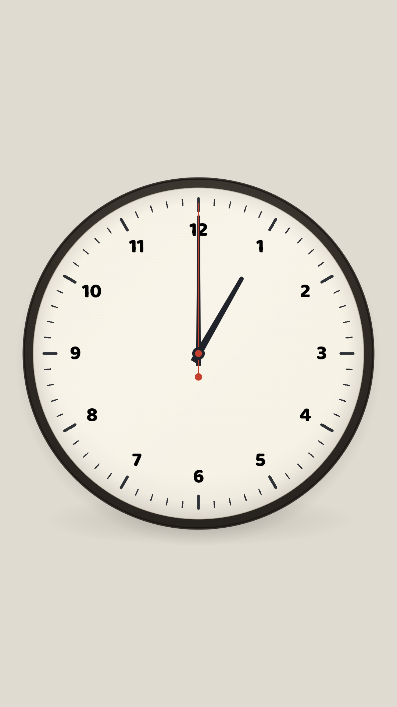
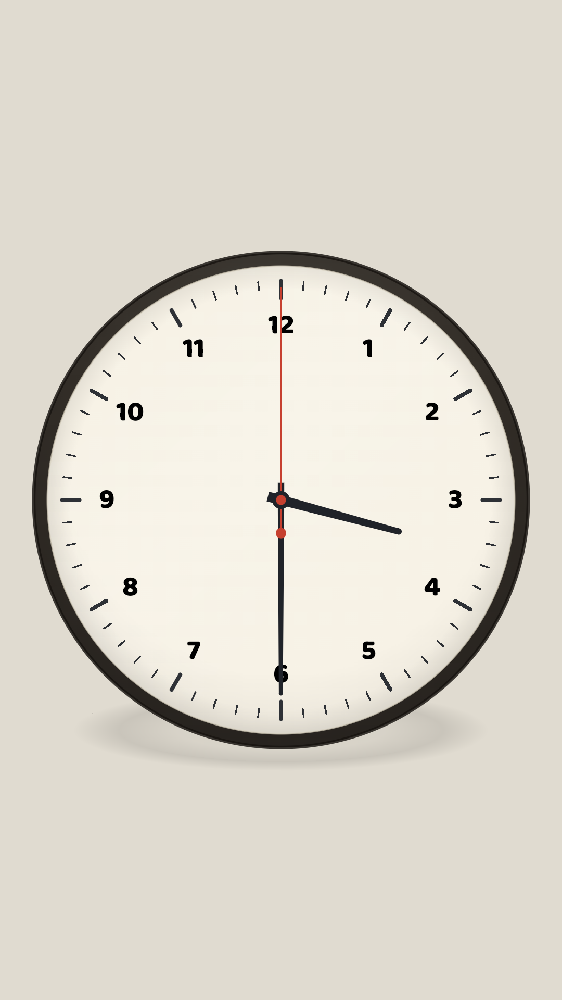
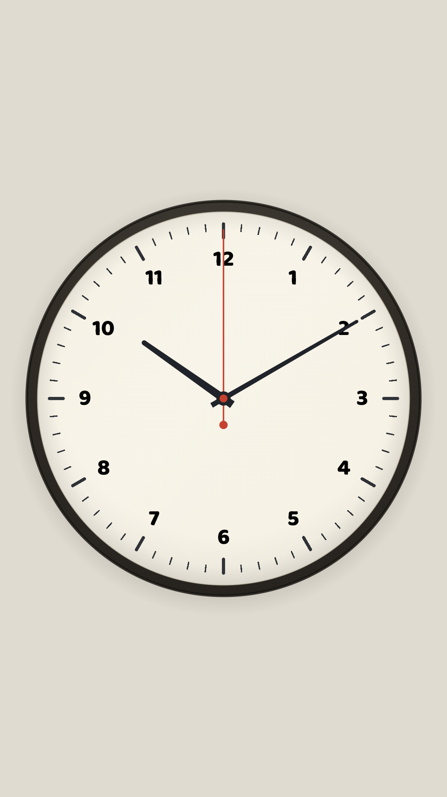

# Read-o-Clock

A real wall clock, alone on the screen, for teaching a young child to read
the time. The hands are the teaching tool: drag either one and the whole
gear train follows. Native Android, paid once, fully offline: no ads, no
trackers, no accounts, no network, no permissions. Open source under MIT.

Status: release 0.4 (versionCode 4), with the one-knock quartz tick and
the shadow under the case, was submitted for Play review on 17 September
2026. Releases 0.3, 0.2 and 0.1 were submitted earlier the same day.

<p align="center">
  
  
  
</p>

- **Play Store package:** `io.github.muntasimulhaque.readoclock`
- **Store listing:** Read-o-Clock: Clock Reading
- **License:** MIT
- **Price:** paid once, no ads, no purchases, no subscriptions
- **Privacy policy:** [online](https://muntasimulhaque.github.io/read-o-clock/privacy.html) · [in this repo](docs/privacy.html)

## The clock

One clock on one screen, nothing else. It opens on the real local time and
keeps it, with a second hand that ticks the way a quartz wall clock ticks:
one step per second, with the small overshoot and settle a real hand makes,
and the soft click that goes with it.

The hands are one gear train, the way a real clock's are. Move the long hand
and the short hand follows it; move the short hand and the long hand winds
around; the seconds move with them, because the minute hand's position is
the minutes plus the seconds. At half past three the hour hand sits exactly
between the 3 and the 4. Let go near a whole minute and the hands settle
onto it, so one o'clock can be exactly one o'clock with the second hand on
its twelve. Once released, the whole clock runs.

There is no menu, no settings, no digital readout, and nothing to tap but
the hands: a finger lands on a hand and carries it around, and a touch
anywhere else, however jittery, moves nothing. The only sound is the
clock's own tick, one soft click with each step of the second hand.
Closing and reopening the app returns the clock to the real time, so the
next lesson starts clean.

## Private by construction

No ads, no trackers, no analytics, no accounts, and no permissions at all,
not even internet, so the app is incapable of sending anything anywhere.
Nothing is stored on the device and nothing is collected, because there is
nothing to collect. Open source under the MIT license: pay once, use it
forever.

## Layout

```
core/     its own Gradle module, pure Kotlin, zero Android imports: the
          dial proportions, the gear law, the quartz tick, the setter,
          hand picking, the spoken time
app/      Compose: the dial, numerals, ticks, hands, the drag; the host and
          the tick player
tools/    offline generators: design takes, launcher icon, store art, the
          tick
```

The rules are pure data and functions; Android is a player of those rules,
not a participant. No composable takes a ViewModel, which is what lets the
screenshot harness host the dial at any teaching time with no-op callbacks.

## Build

`JAVA_HOME` must point at the Android Studio JBR (it is not on PATH):

```
export JAVA_HOME="/c/Program Files/Android/Android Studio/jbr"
./gradlew :core:test :app:testReleaseUnitTest :app:lintRelease
./gradlew :app:assembleDebug
./gradlew :app:bundleRelease          # signed AAB when the keystore is present
```

Generated assets (run only after a deliberate design change, then commit):

```
./gradlew :tools:makeTakes            # design takes into build/takes, for review
./gradlew :tools:makeIcons            # the launcher icon set
./gradlew :tools:checkIcons           # fails if the committed icon bytes drift
./gradlew :tools:makeTick             # the quartz tick WAV
./gradlew :tools:checkTick            # fails if the committed tick bytes drift
./gradlew :tools:makeArt              # feature graphic and 512 store icon
```

## CI is the loop

`build.yml` runs the rules tests, release lint, the icon and tick pins, the
debug APK and a minified release on every push that touches the app, and
with the signing secrets present it publishes the signed AAB and APK to the
`latest-build` release. `screenshots.yml` captures six scenes each on phone,
7 inch and 10 inch API 35 emulators; those captures are the store
screenshots and the human drift check after UI changes. Captures are
reviewed from CI, never pre-checked on a local emulator.

## Store kit

`play-store/` holds the feature graphic, the 512 icon, the screenshots per
form factor, and `play-store-submission-guide.md` with the paste-ready
listing, the release notes and every Play Console answer. The AAB awaiting
submission sits in `play-store/aab/` and is emptied after the owner submits
it, so a stale build can never be uploaded twice. The privacy policy is
served from `docs/privacy.html` by GitHub Pages.
